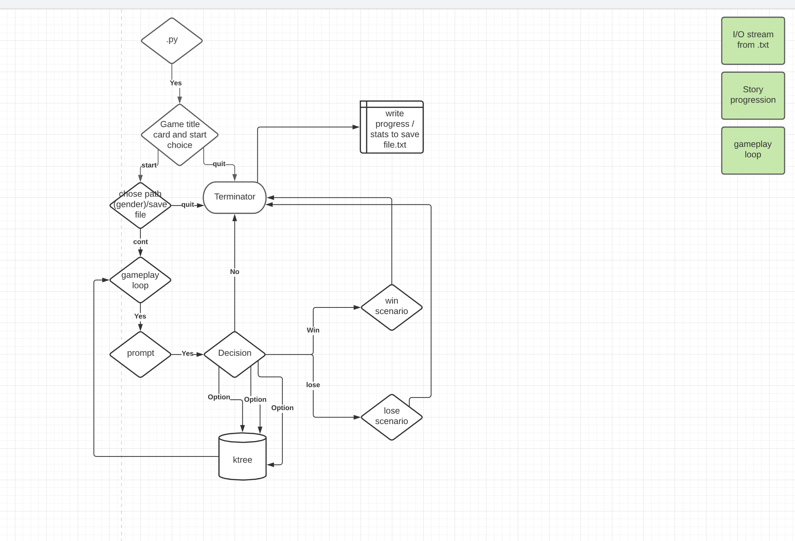

# Crawler_Quest_App

## Authors

 [Brandon](https://github.com/bjgman12)

 [Audrena](https://github.com/NyxofDarkness)

 [Sam](https://github.com/samuelclark907)

 [Louis](https://github.com/louiscaruso)

 [Bhagirath](https://github.com/Bhattb2)

## Description

> Are you bored?
> Do you need to look busy on your console at school or work?
---
This is a python console application made for everyday console fun. Through this text based console adventure you can fight monsters, work your way through a town and explore the land.

---

## Getting Started

Clone this repository to your local machine.

``` python

$ git clone https://github.com/CrawlerQuest/Crawler_Quest_App.git
```

Install Dependencies:

---

``` python
$ cd Crawler_Quest_App
```

---

``` python
npm install
npm init (This creates the json file)
pip install colorama
pip install art
python game_logic.py
```

---

### Change Log


### Model of our game:

 
